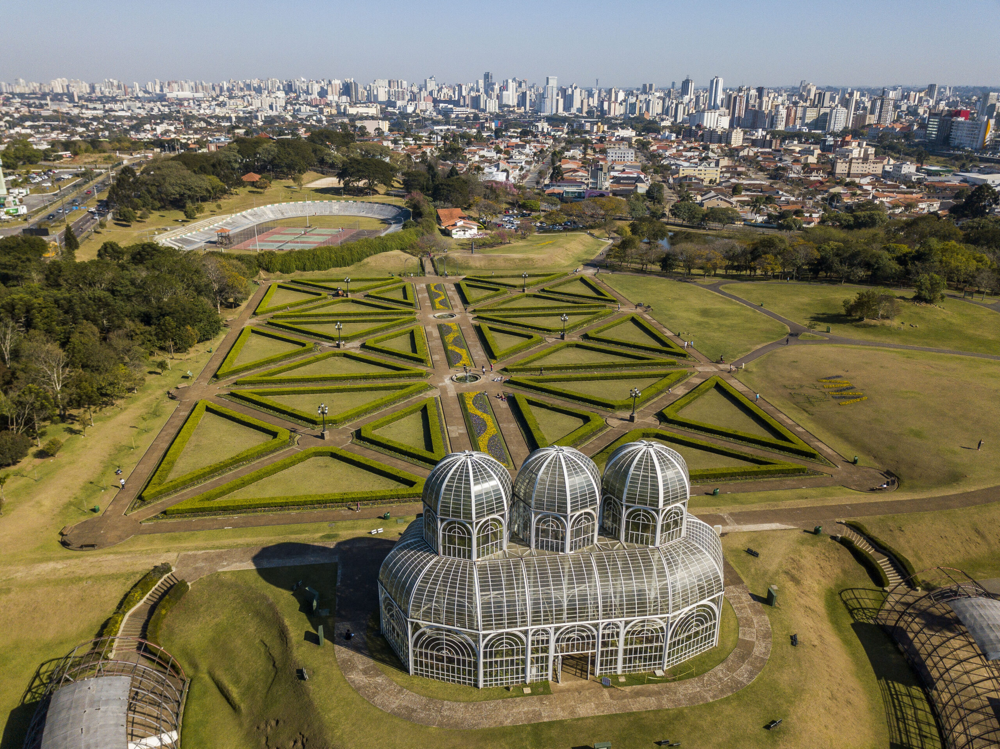

# Vida Terrestre: Campo e Cidade

## Descrição

Bem-vindo ao "Vida Terrestre: Campo e Cidade". Este site explora como a vida terrestre influencia e é influenciada por diferentes ambientes, tanto nas áreas urbanas quanto rurais. Aqui, discutimos os aspectos variados da vida no campo e na cidade, bem como os impactos ambientais e as possíveis soluções para os desafios encontrados.

## Estrutura do Site

### 1. **Cabeçalho (Header)**
   * **Título:** Vida Terrestre: Campo e Cidade
   * **Navegação:** Links para as seções principais do site.
     * [Sobre](#sobre)
     * [No Campo](#campo)
     * [Na Cidade](#cidade)
     * [Impactos](#impactos)
     * [Contato](#contato)

### 2. **Seção Sobre**
   * **Descrição:** Apresenta uma visão geral sobre o papel da vida terrestre tanto nas áreas urbanas quanto rurais, e a importância de entender essas interações para práticas sustentáveis.

### 3. **Seção Vida Terrestre no Campo**
   * **Imagem:** 
   * **Descrição:** Detalha a diversidade da vida no campo, incluindo vegetação, fauna, e a importância da agricultura e da cultura rural. Também aborda desafios como a gestão de recursos e a sustentabilidade.

### 4. **Seção Vida Terrestre na Cidade**
   * **Imagem:** 
   * **Descrição:** Explora a vida nas áreas urbanas, destacando a infraestrutura, oportunidades econômicas, e desafios como poluição e problemas de mobilidade. Discute também a importância da conectividade digital e a gestão ambiental.

### 5. **Seção Impactos e Soluções**
   * **Impactos:**
     * **Campo:** Desmatamento para agricultura, uso de agrotóxicos, e erosão do solo.
     * **Cidade:** Perda de habitat urbano, poluição do ar e da água, e perturbação sonora.
   * **Soluções:**
     * **Campo:** Agricultura sustentável, manejo adequado do solo, e reflorestamento.
     * **Cidade:** Planejamento urbano sustentável, transporte verde, e gestão eficiente de resíduos.

## Tecnologias Utilizadas

* **HTML:** Estrutura do site.
* **CSS:** Estilização do site (arquivo `styles.css`).

---
